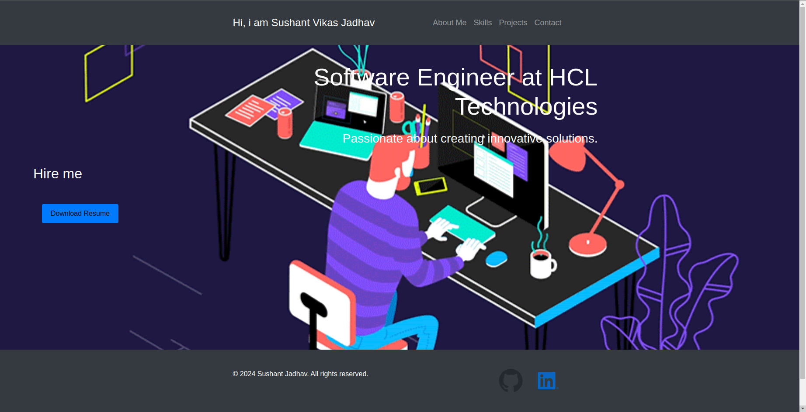

# Portfolio Website Development using React and Containerization using docker tool.
This is portfolio application built using React .

## Screenshot

## Prerequisites:
- React application 
- Docker Installed on your system.

## Containerization of Application
For containerizing our application we need to write a effective dockerfile for containerization .
we are using Multi-stage Build Approach to containerize our application .

### Multi-Stage Build 
Multistage builds offer a great way to streamline Docker images, making them smaller and more secure. We have taken our Dockerfile and improved it by using a multi-stage build. This allows us increase the security of our image by removing the build dependencies from the final image. The final image is now much smaller and only contains the files needed to run the application. The image size has been reduced from 1.7GB to 200MB.

Here is the new Dockerfile with the multi-stage build:

1. Stage 1: Build the application
   
FROM node:21.5-alpine3.18 AS builder

- Set the working directory for the build stage
  
WORKDIR /app

- Copy package.json and package-lock.json
  
COPY package*.json ./

- Install dependencies
  
RUN npm install

- Copy the application source code into the container
  
COPY . .

- Build the application
  
RUN npm run build

2. Stage 2: Create the final image
   
FROM nginx:1.20

-  Set the working directory within the container
  
WORKDIR /app

- Copy the built application files from the builder stage to the nginx html directory
  
COPY --from=builder /app/build /usr/share/nginx/html

- Expose port 80 for the web server
  
EXPOSE 80

- Start nginx in the foreground
  
CMD ["nginx", "-g", "daemon off;"]

